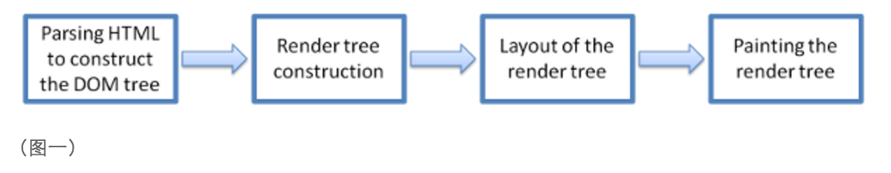

## 从浏览器的渲染原理讲CSS性能

平时我们几乎每天都在和浏览器打交道，写出来的页面很有可能在不同的浏览器下显示的不一样。
苦逼的前端攻城师们为了兼容各个浏览器而不断地去测试和调试，还在脑子中记下各种遇到的BUG及解决方案，
而我们好像并没有去主动地关注和了解下浏览器的工作原理。
如果我们对此做一点了解，我想在项目过程中就可以根据它有效的避免一些问题以及对页面性能做出相应的改进。
下面让我们一起来揭开浏览器的渲染原理这一神秘的面纱吧：

```
最终决定浏览器表现出来的页面效果的差异是：渲染引擎 Rendering Engine（也叫做排版引擎），
也就是我们通常所说的“浏览器内核”，负责解析网页语法（如HTML、JavaScript）并渲染、展示网页。
相同的代码在不同的浏览器呈现出来的效果不一样，那么就很有可能是不同的浏览器内核导致的。
```

我们来看一下加载页面时浏览器的具体工作流程（图一）：



```
1、解析HTML以重建DOM树（Parsing HTML to construct the DOM tree ）：渲染引擎开始解析HTML文档，
转换树中的标签到DOM节点，它被称为“内容树”。

2、构建渲染树（Render tree construction）：解析CSS（包括外部CSS文件和样式元素），
根据CSS选择器计算出节点的样式，创建另一个树 —- 渲染树。

3、布局渲染树（Layout of the render tree）: 从根节点递归调用，计算每一个元素的大小、位置等，
给每个节点所应该出现在屏幕上的精确坐标。

4、绘制渲染树（Painting the render tree） : 遍历渲染树，每个节点将使用UI后端层来绘制。

主要的流程就是：构建一个dom树，页面要显示的各元素都会创建到这个dom树当中，每当一个新元素加入到这个dom树当中，
浏览器便会通过css引擎查遍css样式表，找到符合该元素的样式规则应用到这个元素上。
```

注意了：`css引擎查找样式表，对每条规则都按从右到左的顺序去匹配`。 看如下规则：
```
#nav  li {}
```
看起来很快，实际上很慢，尽管这让人有点费解#_#。我们中的大多数人，尤其是那些从左到右阅读的人，
可能猜想浏览器也是执行从左到右匹配规则的，因此会推测这条规则的开销并不高。
在脑海中，我们想象浏览器会像这样工作：找到唯一的ID为nav的元素，然后把这个样式应用到直系子元素的li元素上。
我们知道有一个ID为nav的元素，并且它只有几个Li子元素，所以这个CSS选择符应该相当高效。

事实上，CSS选择符是从右到左进行匹配的。了解这方面的知识后，我们知道这个之前看似高效地规则实际开销相当高，
浏览器必须遍历页面上每个li元素并确定其父元素的id是否为nav。

```
*{}
```
额，这种方法我刚写CSS的也写过，殊不知这种效率是差到极点的做法，因为*通配符将匹配所有元素，
所以浏览器必须去遍历每一个元素，这样的计算次数可能是上万次！

```
ul#nav{} ul.nav{}
```
在页面中一个指定的ID只能对应一个元素，所以没有必要添加额外的限定符，而且这会使它更低效。
同时也不要用具体的标签限定类选择符，而是要根据实际的情况对类名进行扩展。例如把ul.nav改成.main_nav更好。

```
ul li li li .nav_item{}
```
对于这样的选择器，之前也写过，最后自己也数不过来有多少后代选择器了，何不用一个类来关联最后的标签元素，
如.extra_navitem，这样只需要匹配class为extra_navitem的元素，效率明显提升了

## 对此，在CSS书写过程中，总结出如下性能提升的方案：

1. 避免使用通配规则      如    *{} 计算次数惊人！只对需要用到的元素进行选择
2. 尽量少的去对标签进行选择，而是用class     如：#nav li{},可以为li加上nav_item的类名，如下选择.nav_item{}
3. 不要去用标签限定ID或者类选择符   如：ul#nav,应该简化为#nav
4. 尽量少的去使用后代选择器，降低选择器的权重值   后代选择器的开销是最高的，尽量将选择器的深度降到最低，
最高不要超过三层，更多的使用类来关联每一个标签元素
5. 考虑继承 了解哪些属性是可以通过继承而来的，然后避免对这些属性重复指定规则
6. 选用高效的选择符，可以减少页面的渲染时间，从而有效的提升用户体验（页面越快，用户当然越喜欢^_^）,
你可以看一下CSS selectors Test，这个实验的重点是评估复杂选择符和简单选择符的开销。
也许当你想让渲染速度最高效时，你可能会给每个独立的标签配置一个ID，然后用这些ID写样式。
那的确会超级快，也超级荒唐！这样的结果是语义极差，后期的维护难到了极点。

```
但说到底，CSS性能这东西对于小的项目来讲可能真的是微乎其微的东西，提升可能也不是很明显，但对于大型的项目肯定是有帮助的。
而且一个好的CSS书写习惯和方式能够帮助我们更加严谨的要求自己。
```