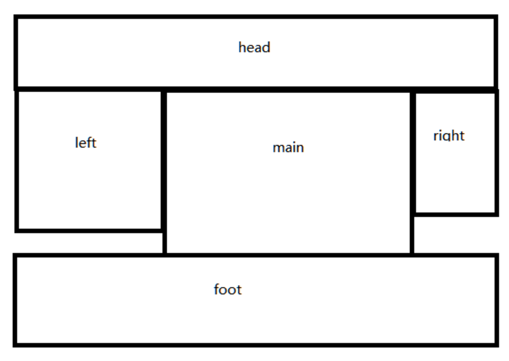
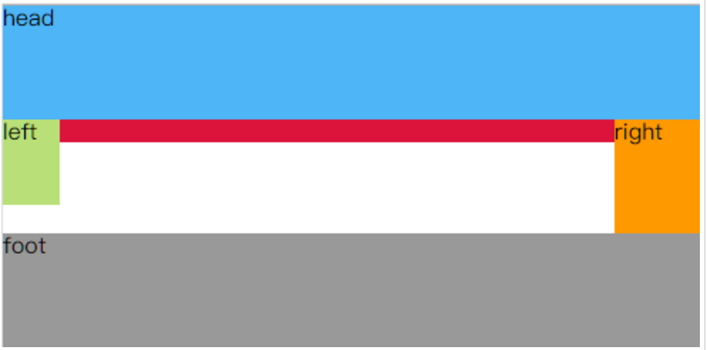
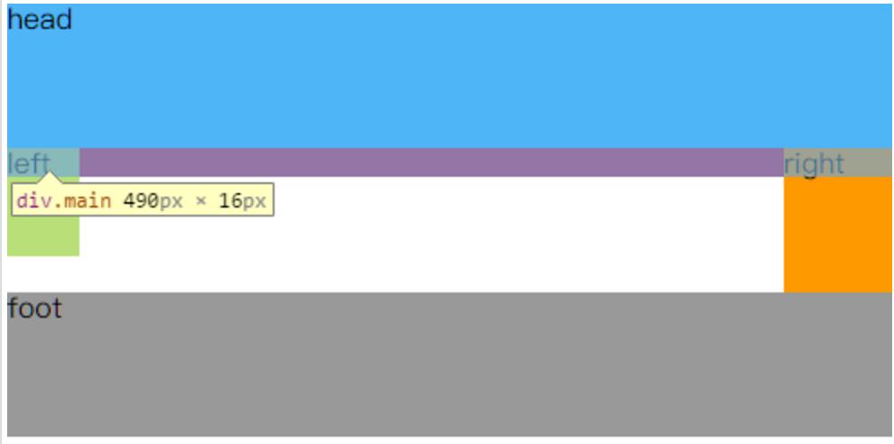
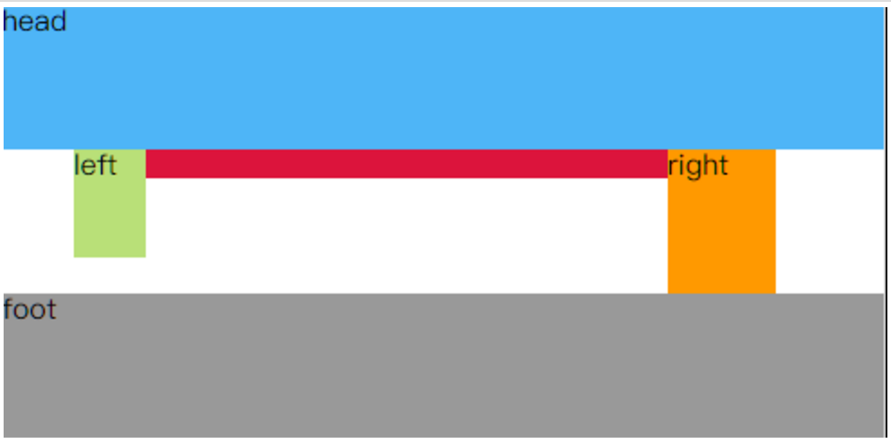
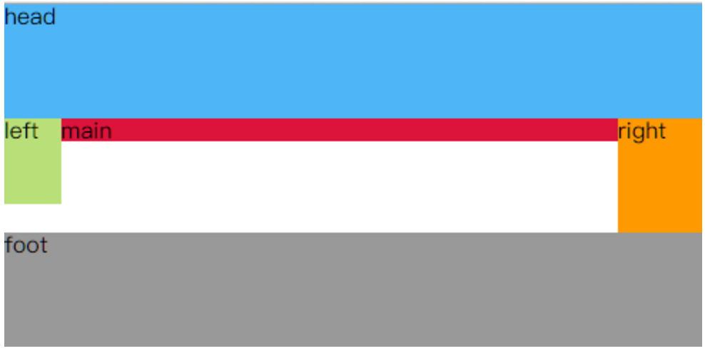

## 奇妙的圣杯与双飞翼
相信很多人和我在学习前端差不多的时候就听说过了圣杯布局与双飞翼布局。
关于取名无非是觉得长得像圣杯，或者是长得像小鸟。
至于其中的区别也只有一小点，其中主要的思想可谓是基本一致！

这两个布局要实现的样式都是下面的这种形式：



也就是中间的那一部分，长得像圣杯或者是飞翔的小鸟，left 和 right 宽度已知，中间自适应填充。
一般情况下，如果这样写代码，显然是很好实现布局的。

```
<div class="head">head</div>
    <div class="content">
        <div class="left">left</div>
        <div class="main">main</div>
        <div class="right">right</div>
    </div>
 <div class="foot">foot</div>
```

但是相应的按照 DOM 的加载顺序，content 部分依次会加载 left、main、right。
这对于有洁癖的人可能是无法忍受的，甚至是觉得不符合常理。

`正常情况下，我们希望先加载的是主要部分，然后再开始加载 left 和 right 两个相对来说不是很重要的东西。`

所以 HTML 代码应该这样写：
```
<div class="head">head</div>
    <div class="content">
        <div class="main">main</div>
        <div class="left">left</div>
        <div class="right">right</div>
    </div>
<div class="foot">foot</div>
```

另外一方面来说，我们倡导语义化的 HTML，也就是说在编写 HTML 的时候不应该受制于 CSS 的干扰，
所以这样的写法来达到上面的布局也应该是必要的。

那么如果这样写应该如何去写 CSS 样式呢？

首先我们的想法可能是先搭建起 head content 和 foot，content 里面的东西全部用左浮动解决，对 content 要清除浮动让他撑起高度。

代码如下：
```
* {
    margin: 0;
    padding: 0;
}
.cleanfix {
    clear: both;
}
.cleanfix:after {
    content: '.';
    clear: both;
    display: block;
    visibility: hidden;
    height: 0;
    zoom: 1;
}
.head, .foot {
    width: 100%;
    height: 80px;
}
.head {
    background-color: #4eb5f7;
}
.foot {
    background-color: #999999;
}
.left, .right, .main {
    float: left;
}
.left {
    width: 40px;
    height: 60px;
    background-color: #B9E078;
}
.right {
    width: 60px;
    height: 80px;
    background-color: #FF9900;
}
.main {
    background-color: crimson;
}
```

这样的话就能实现下面的布局：


我们要的目的是 main 布局自适应，这样的话我们给 main 100% 的宽度：
```
.main {
  100%;
}
```
这样的话布局就会变成这样：


接下来，我们想要 left 跑上去，这个时候就可以使用奇妙的`负边距`了。

main, left, right 我们都可以看做是在一个浮动流中，依次的顺序也是 main left right。
目前是因为 main 占了100% 从而导致 left 与 right 不能和 main 浮在同一行了，
`这个时候我们可以利用负边距来让 left 向前移动 （即 margin-left 为正的时候就是和左边的盒子的外边距，
那么为负的时候就是像前移动了）`。

加上下面的特技
```
.left {
    margin-left: 100%;
}
```
那么移动多少呢？为了让 left 跑到最左边，那么就像上面的一样移动到 -100% ，也就是向左移动的最大值了。

这样，会得到下面的布局：


我们看到 left 移动到最左边了，那 right 是不是也可以模仿 left 一起移动呢？
移动多少？right 只需要向前移动right的宽度个距离，即 60px
```
.right {
    margin-left: -60px;
}
```

得到下面的结果



和我们想象中的一样， right 也移动上去了，并且跑到了我们想要的位置。

但是稍微细心点就能发现上面的结果还是存在问题的，红色中间部分的 main 跑到哪里去了？

打开开发者工具审查元素就能看见好像是 left 和 right 覆盖到上面去了。



那么如何去使得 main 部分往里面收收呢？这也就是`圣马布局与双飞翼布局`根本区别了

## 圣杯布局
```
圣杯布局的思想就是给包裹着三个元素的 content 加一个 padding, 
让 padding-left 和 padding-right 的数值是 left 和 right 的宽度，
然后利用相对定位把他们再移动在两旁。
```

首先，给 content padding
```
.content {
    padding: 0 60px 0 40px;
}
```



然后利用相对定位移动 left 和 right
```
.left {
    position: relative;
    left: -40px;
}
.right {
    position: relative;
    right: -60px;
}
```
这样也就完美的解决了问题：



最后 CSS 的所有样式是这样的：
```
* {
    margin: 0;
    padding: 0;
}
.cleanfix {
    clear: both;
}
.cleanfix:after {
    content: '.';
    clear: both;
    display: block;
    visibility: hidden;
    height: 0;
    zoom: 1;
}
.head, .foot {
    width: 100%;
    height: 80px;
}
.head {
    background-color: #4eb5f7;
}
.foot {
    background-color: #999999;
}

.left, .right, .main {
    float: left;
}
.left {
    width: 40px;
    height: 60px;
    background-color: #B9E078;
    margin-left: -100%;
}
.right {
    width: 60px;
    height: 80px;
    background-color: #FF9900;
    margin-left: -60px;
}
.main {
    background-color: crimson;
    width: 100%;
}
.content {
    padding: 0 60px 0 40px;
}

.left {
    position: relative;
    left: -40px;
}
.right {
    position: relative;
    right: -60px;
}
```

HTML 是这样的：
```
<div class="head">head</div>
    <div class="content cleanfix">
        <div class="main">main</div>
        <div class="left">left</div>
        <div class="right">right</div>
    </div>
<div class="foot">foot</div>
```

## 双飞翼布局
延续到上面的情况，圣马布局是这样做的
```
圣马布局的思想就是给包裹着三个元素的 content 加一个 padding, 
让 padding-left 和 padding-right 的数值是 left 和 right 的宽度，然后利用相对定位把他们再移动在两旁。
```

```
而双飞翼布局是在 main 里面再添加一个 div, 然后对这个 div 进行 margin-left 和 margin-right.
```
即
```
<div class="head">head</div>
    <div class="content cleanfix">
        <div class="main">
            <div class="wrap">main</div>
        </div>
        <div class="left">left</div>
        <div class="right">right</div>
    </div>
<div class="foot">foot</div>
```
CSS 部分对 wrap 进行处理：
```
.wrap {
    background-color: darkmagenta;
    margin-left: 40px;
    margin-right: 60px;
}
```


最后我们的CSS代码是这样的：
```
* {
    margin: 0;
    padding: 0;
}
.cleanfix {
    clear: both;
}
.cleanfix:after {
    content: '.';
    clear: both;
    display: block;
    visibility: hidden;
    height: 0;
    zoom: 1;
}
.head, .foot {
    width: 100%;
    height: 80px;
}
.head {
    background-color: #4eb5f7;
}
.foot {
    background-color: #999999;
}

.left, .right, .main {
    float: left;
}
.left {
    width: 40px;
    height: 60px;
    background-color: #B9E078;
    margin-left: -100%;
}
.right {
    width: 60px;
    height: 80px;
    background-color: #FF9900;
    margin-left: -60px;
}
.main {
    background-color: crimson;
    width: 100%;
}

.wrap {
    background-color: darkmagenta;
    margin-left: 40px;
    margin-right: 60px;
}
```

## 总结
总结一下，圣马布局和双飞翼的流程大体上是这样的
```
搭建 head content foot, content 内部的三个元素全部左浮动，然后清除浮动防止影响 foot
给 main 100% 的宽度让他占满一行
给 left -100% 的margin-left 让他移动到最左边，给 right 和他宽度一样的负 margin 让他移动到最右边
针对移动后 main 的两边会被 left 和 right 重合覆盖掉做出不同的改变，这儿也就是两个布局的本质区别

圣杯布局会给 content 内边距，左右分别为 left 和 right的宽度，然后再利用相对定位移动 left 和 right
双飞翼布局会在 main 里面再加一层 wrap ，然后把内容都写在 wrap 里面，正对 wrap 设置他的 margin, 
左右外边距和 left 与 right 一样
```

## 奇妙的负边距
相信在上面的圣马布局与双飞翼布局中已经见识到了负边距的奇妙之处了，这就是他的第一奇妙之处

### 浮动元素 VS 负边距
```
整个浮动可以看是有一个浮动流的存在，利用负边距可以让他在这个流中移动，并且会叠加到相应元素的上面
```

### 普通文档流 VS 负边距
```
普通元素的位置是相对于文档流而发生变化的。负边距也会使元素在文档流中发生位移。
不同于相对定位的是，这些元素移动之后不会占据原来的空间。
他往前移动之后，文档流也会跟着移动
```

### 元素宽度 VS 负边距
```
负边距可以增加元素的宽度，对于没有 width 的元素，负边距可以加宽他们。

这样就能够很好的利用负边距实现 一寸照片排列 的那种难题了。
对于这种问题，比较麻烦的办法是浮动之后 margin-right, 然后对每一行的最后一个元素设置 margin-right: 0。
这样就存在一个如何给最后一个元素设定这个margin-right的问题了。

利用负边距，我们可以加大子元素的margin, 然后浮动里面所有的元素，
等他们都浮动起来的时候利用 overflow: hidden消除最右边的边距。
```

### 绝对定位 VS 负边距
```
绝对定位就是相对于父亲系元素的最近的一个定位元素的边界来决定的，这个边界也就是margin。
```
如果是负边距的话就能机智的实现元素垂直水平居中了
```
.con {
    width: 100px;
    height: 100px;
    position: absolute;
    top: 50%;
    left: 50%
    margin-left: -50px;
    margin-top: -50px;
}
```