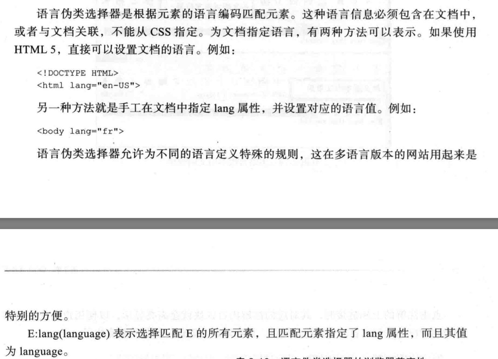
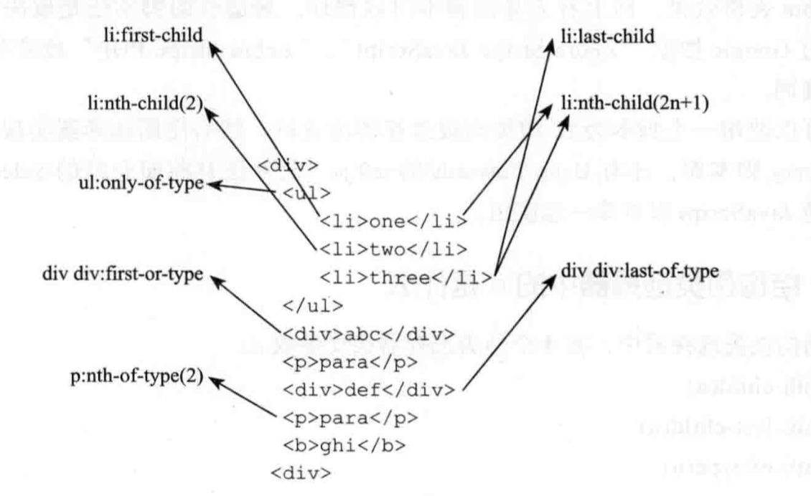

## css3选择器

## 1. 基本选择器(css1、css2全部涵盖)

1. 通配符选择器(*)
2. 元素选择器(或者叫标签选择器)
3. ID选择器
4. 类选择器
5. 群组选择器

## 2. 层次选择器

1. 后代选择器(E F)
2. 子元素选择器(E>F: 选择E的`直接子元素`F)
3. 相邻兄弟选择器(E+F: 选择`紧位于E后面的兄弟元素F`)
4. 通用兄弟选择器(E~F: 选择`位于E后面的所有兄弟元素F`)


## 3. 伪类选择器
#### 1. 动态伪类选择器
```
- :link
- :visited
- :hover
- :focus 
- :active
```

#### 2. 目标伪类选择器
```
- :target, 用来匹配文档(页面)的URI中某个标识符的目标元素。(P30)

具体来说,URI地址中通常会包含#号,后面跟着标识符的名称,例如"#contact",
:target就是用来匹配ID为contact的元素的。
```

#### 3. 语言伪类选择器



#### 4. UI状态伪类选择器
```
- E:checked
- E:enabled
- E:disabled
- E:focus
- E:active
```

#### 5. 结构伪类选择器
```
- E:first-child, 等价于E:nth-child(1), 作为第一个子元素的元素E
- E:last-child, 等价于E:nth-last-child(1)
- E:root(匹配元素所在文档的根元素,始终未html)
- E F:nth-child (选取元素E的第n个子元素F)
- E F:nth-last-child (选取元素E的倒数第n个子元素F)
- E:nth-of-type(n) 选取文档内具有指定类型的第n的E元素
- E:nth-last-of-type(n) 选取文档内具有指定类型的倒数第n的E元素
- E:first-of-type
- E:last-of-type
- E:only-of-type 选取父元素只包含一个同类型E的元素
- E:only-child 选取父元素只包含一个子元素E的元素
- E:empty 选取没有子元素也不包含任何文本节点的元素
```



结构伪类选择器中的n的取值和含义
```
n是从0开始递增的整数!

1. n为具体数值: 表示选择第n个元素

2. n为表达式 n*length : 选择n的倍数,例如2n,表示选择第2、4、6、8..个元素

3. n为表达式 n+length: 表示选择第n个以后的元素,例如:nth-child(n+3),表示选择第3、4、5、6..个元素

4. n为表达式-n+length, 表示选择前n个元素, 例如-n+3,表示选择第-0+3,-1+3,-2+3即第3,2,1个元素

5. n为表达式n*length+b: 例如2n+1,表示选择第1,3,5,7,9..个元素

6. n取关键字'odd',表示选取奇数元素,等价于2n+1,2n-1

7. n取关键字'even',偶数,等价于2n
```

#### 6. 否定伪类选择器
```
- :not, 表示否定,对其他选择器取反

例:
:not(p){...}

:not([type='input']){...}

:not(:hover)
```


## 4. 伪元素选择器
```
- ::first-letter
- ::first-line
- ::before 和 ::after, 要生成内容,需要配合content属性!
- ::selection : 匹配网页中选中的元素
```


## 5. 属性选择器
```
- E[attr] 选择具有attr属性的E元素
- E[attr=val] 选择属性attr等于val的E元素
- E[attr|=val] 选择属性attr以val或val-开头的E元素
- E[attr~=val] attr属性具有多个以空格分隔的属性值,这些值中包含val
- E[attr*=val] attr属性值中包含子串val
- E[attr^=val] attr属性值以val开头
- E[attr$=val] attr属性值以val结尾

```
