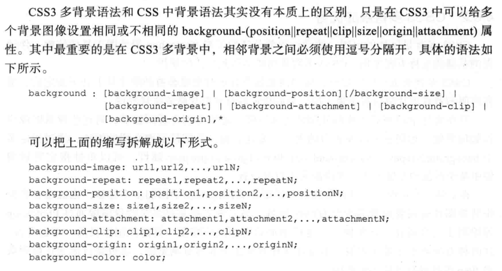

## CSS3背景属性

```
- background-origin: padding-box || border-box || content-box (老语法:padding || border || content)
    padding-box: 从padding的外边缘开始显示背景图片
    border-box: 从border的外边缘开始显示背景图片
    content-box: 从content的外边缘开始显示背景图片
    
- background-clip: border-box || padding-box || content-box
    border-box: 背景图片在边框下,默认值, 即边框外的背景将被裁剪掉
    padding-box: 背景延伸到padding的外边缘,但不会超出边框的范围,即padding外的背景将被裁剪掉
    content-box: 背景仅在内容区域绘制,不会超出padding和边框的范围,即content外的背景将被裁剪掉
    
- background-size: auto || <percentage> || <length> || cover || contain
    percentage: 不是根据背景图片大小计算,而是根据元素的*宽度*来计算!!!
    cover: 将背景图片放大,以适应整个容器
    contain: 保持背景图像本身的宽高比例,将背景图像缩放到宽度或者高度正好适应所定义的背景容器的区域
    
- background-break
```

## CSS3多背景语法
