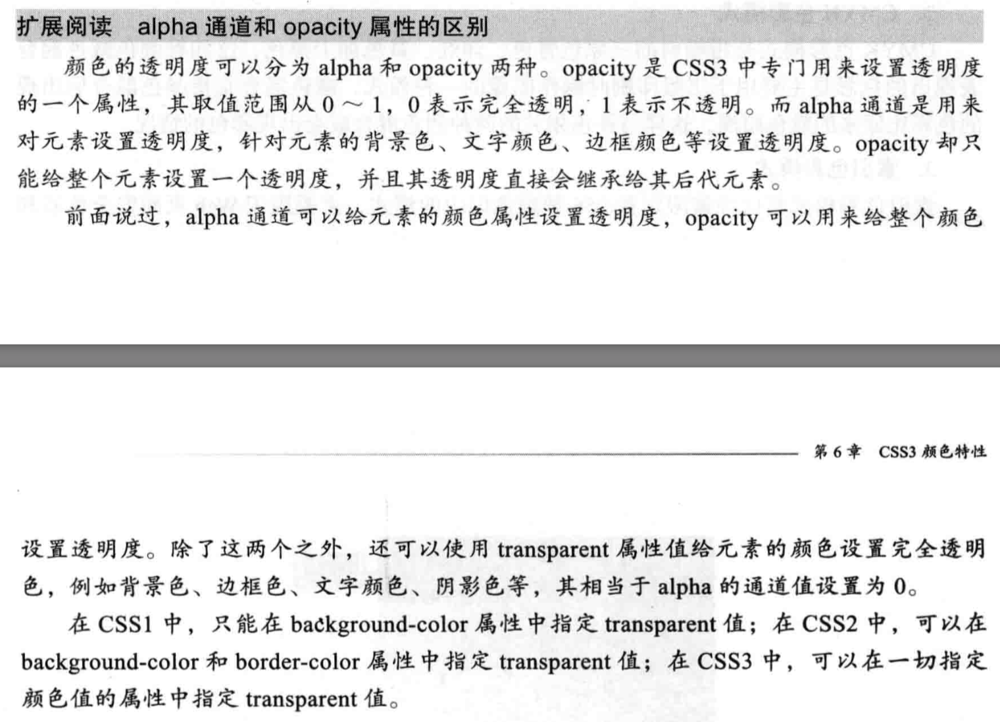

## css颜色


### css3透明属性 opacity
```
opacity: alphavalue || inherit
    alphavalue: 取值0~1, 1表示完全不透明,0表示完全透明
    inherit: 继承父元素的透明度

```

### css3颜色模式  RGBA
```
rgba(r,g,b,a)
```

### opacity和alpha的区别
