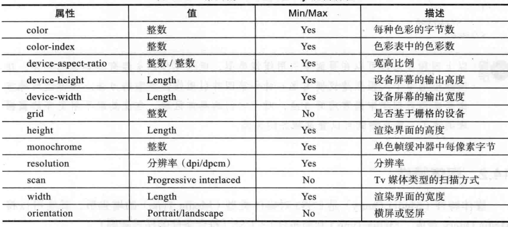
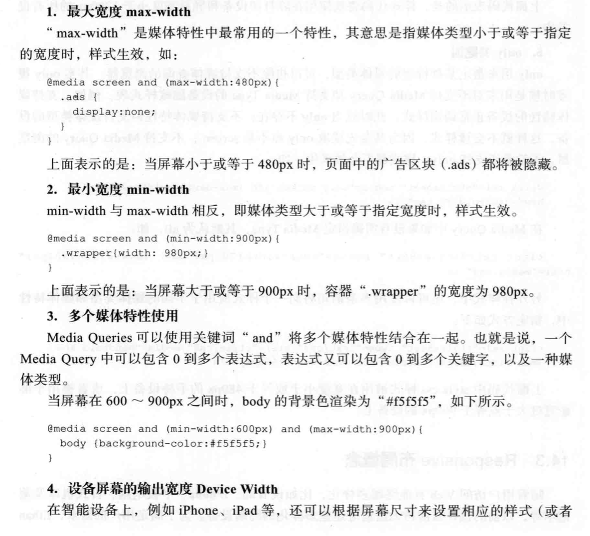
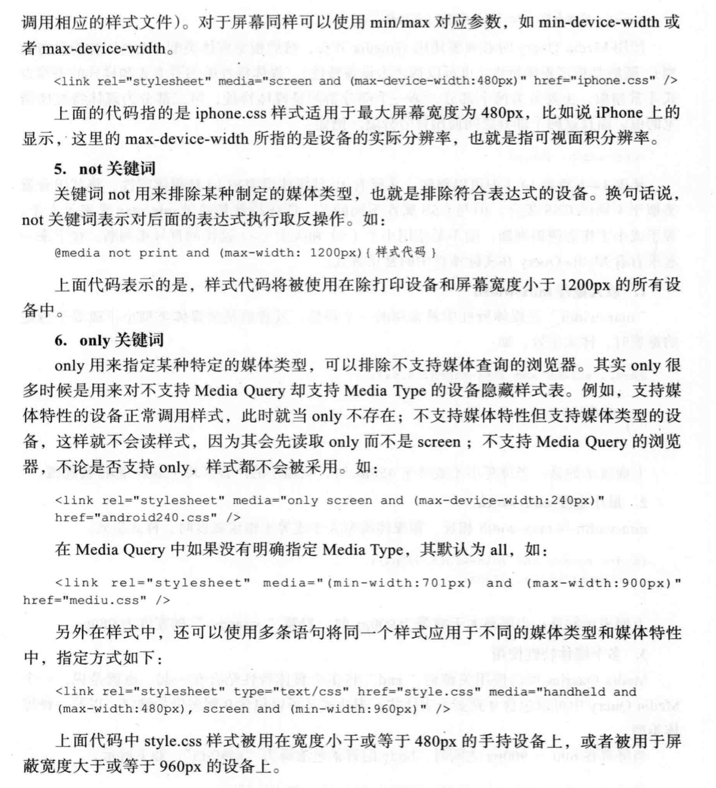

## 媒体查询与响应式布局

### 常见的4中媒体引用方法

1. link方法
```
<link rel="stylesheet" type="text/css" href="screen.css" media="screen"/>
<link rel="stylesheet" type="text/css" href="print.css" media="print"/>
```

2. xml方式
```
<?xml-stylesheet rel="stylesheet" media="screen" href="screen.css" ?>
```

3. import方式
```
@import url("screen.css") screen;
@import url("print.css") print;
```

4. media方式
```
@media screen {
    // css样式
}
```

常见的媒体类型如下:


### 媒体特性
```
<link rel="stylesheet" type="text/css" href="screen.css" 
      media="screen and (max-width: 600px) and (max-width:1024px)"/>

@media screen and (min-width:600px) and (max-width:1024px) {
    // css样式
}
```

常见的媒体特性如下:



### 常用的媒体查询方式

