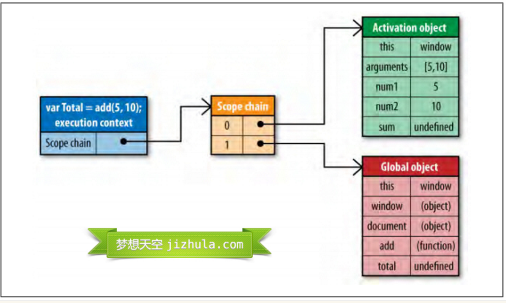
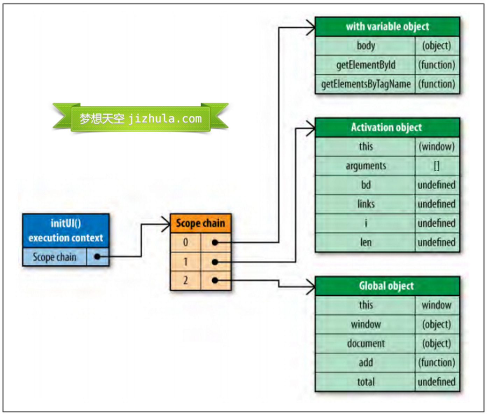

## 作用域链详解

#### JavaScript作用域

任何程序设计语言都有作用域的概念.
`简单的说，作用域就是变量与函数的可访问范围，即作用域控制着变量与函数的可见性和生命周期。`
在JavaScript中，变量的作用域有`全局作用域`和`局部作用域`两种。

### 全局作用域（Global Scope）

在代码中任何地方都能访问到的对象拥有全局作用域，一般来说以下几种情形拥有全局作用域：
#### 1.最外层函数和在最外层函数外面定义的变量拥有全局作用域，例如：

    var authorName="山边小溪";
    function doSomething(){
        var blogName="梦想天空";
        function innerSay(){
            alert(blogName);
        }
        innerSay();
    }
    alert(authorName); //山边小溪
    alert(blogName); //脚本错误
    doSomething(); //梦想天空
    innerSay() //脚本错误

#### 2. 所有末定义直接赋值的变量自动声明为拥有全局作用域，例如：
    function doSomething(){
        var authorName="山边小溪";
        blogName="梦想天空";
        alert(authorName);
    }
    doSomething(); //山边小溪
    alert(blogName); //梦想天空
    alert(authorName); //脚本错误
    
    变量blogName拥有全局作用域，而authorName在函数外部无法访问到。

#### 3. 所有window对象的属性拥有全局作用域

    一般情况下，window对象的内置属性都拥有全局作用域，例如window.name、window.location、window.top等等。

### 局部作用域（Local Scope）　　
和全局作用域相反，`局部作用域一般只在固定的代码片段内可访问到，最常见的例如函数内部`，
所有在一些地方也会看到有人把这种作用域称为`函数作用域`，
例如下列代码中的blogName和函数innerSay都只拥有局部作用域。

    function doSomething(){
        var blogName="梦想天空";
        function innerSay(){
            alert(blogName);
        }
        innerSay();
    }
    alert(blogName); //脚本错误
    innerSay(); //脚本错误

### 作用域链（Scope Chain）

在JavaScript中，函数也是对象，实际上，JavaScript里一切都是对象。
函数对象和其它对象一样，拥有可以通过代码访问的属性和一系列仅供JavaScript引擎访问的内部属性。
其中一个内部属性是`[[Scope]]`，由ECMA-262标准第三版定义，
`该内部属性包含了函数被创建的作用域中对象的集合，这个集合被称为函数的作用域链，它决定了哪些数据能被函数访问。`

### `当一个函数创建后，它的作用域链会被创建此函数的作用域中可访问的数据对象填充!!`。
例如定义下面这样一个函数：

    function add(num1,num2) {
        var sum = num1 + num2;
        return sum;
    }
    
在函数add`创建`时，它的作用域链中会填入一个全局对象，该全局对象包含了所有全局变量。
如下图所示（注意：图片只例举了全部变量中的一部分）：

### `函数add的作用域将会在执行时用到。`
例如执行如下代码：

    var total = add(5,10);
    
### 执行此函数时会创建一个称为`“运行期上下文(execution context)”`的内部对象，运行期上下文定义了函数执行时的环境。
每个运行期上下文都有自己的作用域链，用于标识符解析，当运行期上下文被创建时，
而它的作用域链初始化为当前运行函数的`[[Scope]]`所包含的对象。
这些值按照它们出现在函数中的顺序被复制到运行期上下文的作用域链中。
它们共同组成了一个新的对象，叫`“活动对象(activation object)”`，该对象包含了函数的所有局部变量、命名参数、
参数集合以及this，然后此对象会被推入作用域链的前端，当运行期上下文被销毁，活动对象也随之销毁。
新的作用域链如下图所示：

    在函数执行过程中，每遇到一个变量，都会经历一次标识符解析过程以决定从哪里获取和存储数据。
    该过程从作用域链头部，也就是从活动对象开始搜索，查找同名的标识符，如果找到了就使用这个标识符对应的变量，
    如果没找到继续搜索作用域链中的下一个对象，如果搜索完所有对象都未找到，则认为该标识符未定义。
    函数执行过程中，每个标识符都要经历这样的搜索过程。

### 作用域链和代码优化

    从作用域链的结构可以看出，在运行期上下文的作用域链中，标识符所在的位置越深，读写速度就会越慢。
    如上图所示，因为全局变量总是存在于运行期上下文作用域链的最末端，因此在标识符解析的时候，查找全局变量是最慢的。
    所以，在编写代码的时候应尽量少使用全局变量，尽可能使用局部变量。
    一个好的经验法则是：如果一个跨作用域的对象被引用了一次以上，则先把它存储到局部变量里再使用。

例如下面的代码：

    function changeColor(){
        document.getElementById("btnChange").onclick=function(){
            document.getElementById("targetCanvas").style.backgroundColor="red";
        };
    }
这个函数引用了两次全局变量document，查找该变量必须遍历整个作用域链，直到最后在全局对象中才能找到。
这段代码可以重写如下：

    function changeColor(){
        var doc=document;
        doc.getElementById("btnChange").onclick=function(){
            doc.getElementById("targetCanvas").style.backgroundColor="red";
        };
    }
这段代码比较简单，重写后不会显示出巨大的性能提升，但是如果程序中有大量的全局变量被从反复访问，
那么重写后的代码性能会有显著改善。

### 改变作用域链
函数每次执行时对应的运行期上下文都是独一无二的，所以多次调用同一个函数就会导致创建多个运行期上下文，
当函数执行完毕，执行上下文会被销毁。每一个运行期上下文都和一个作用域链关联。
一般情况下，在运行期上下文运行的过程中，其作用域链只会被 `with 语句`和 `catch 语句`影响。

with语句是对象的快捷应用方式，用来避免书写重复代码。例如：

    function initUI(){
        with(document){
            var bd=body,
                links=getElementsByTagName("a"),
                i=0,
                len=links.length;
            while(i < len){
                update(links[i++]);
            }
            getElementById("btnInit").onclick=function(){
                doSomething();
            };
        }
    }
这里使用with语句来避免多次书写document，看上去更高效，实际上产生了性能问题。

**当代码运行到with语句时，运行期上下文的作用域链临时被改变了!**
一个新的可变对象被创建，它包含了参数指定的对象的所有属性。这个对象将被推入作用域链的头部，
这意味着函数的所有局部变量现在处于第二个作用域链对象中，因此访问代价更高了。如下图所示：

`因此在程序中应避免使用with语句，在这个例子中，只要简单的把document存储在一个局部变量中就可以提升性能。`

另外一个会改变作用域链的是try-catch语句中的catch语句。
**当try代码块中发生错误时，执行过程会跳转到catch语句，然后把异常对象推入一个可变对象并置于作用域的头部。
在catch代码块内部，函数的所有局部变量将会被放在第二个作用域链对象中。**
示例代码：

    try{
        doSomething();
    }catch(ex){
        alert(ex.message); //作用域链在此处改变
    }

`请注意，一旦catch语句执行完毕，作用域链机会返回到之前的状态。`
try-catch语句在代码调试和异常处理中非常有用，因此不建议完全避免。
`你可以通过优化代码来减少catch语句对性能的影响。一个很好的模式是将错误委托给一个函数处理，`

例如：

    try{
        doSomething();
    }catch(ex){
        handleError(ex); //委托给处理器方法
    }
优化后的代码，handleError方法是catch子句中唯一执行的代码。
该函数接收异常对象作为参数，这样你可以更加灵活和统一的处理错误。
由于只执行一条语句，且没有局部变量的访问，作用域链的临时改变就不会影响代码性能了。