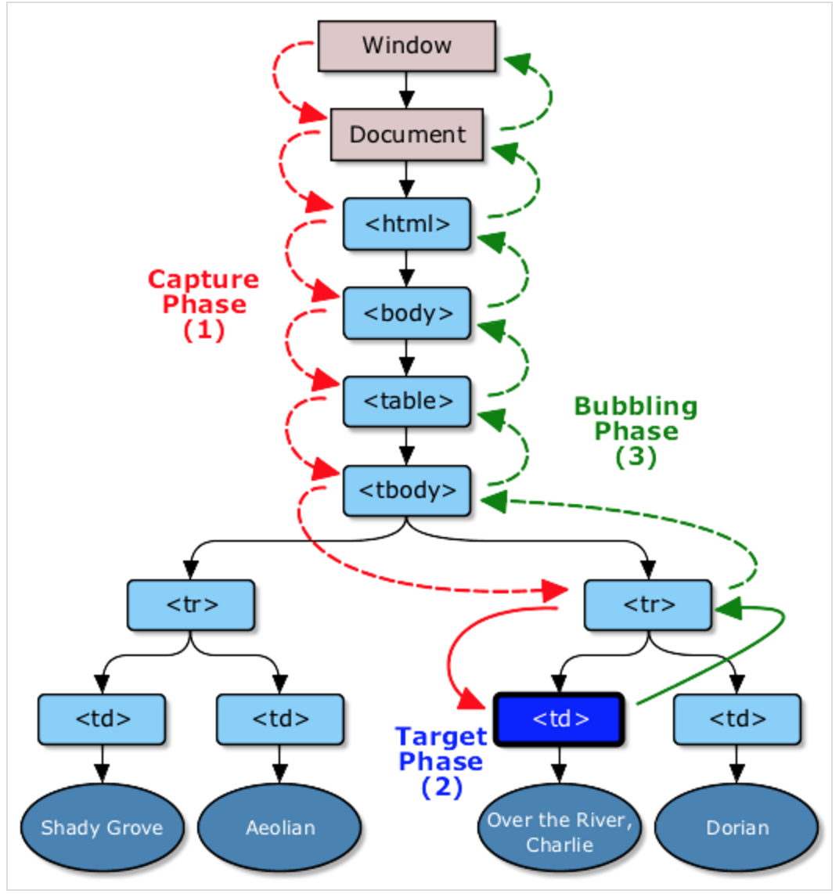

### DOM事件详解
    Click、touch、load、drag、change、input、error、risize — 这些都是冗长的DOM（文档对象模型）事件列表的一部分。
    事件可以在文档(Document)结构的任何部分被触发，触发者可以是用户操作，也可以是浏览器本身。
    事件并不是只是在一处被触发和终止；他们在整个document中流动，拥有它们自己的生命周期。
    而这个生命周期让DOM事件有更多的用途和可扩展性。

#### 监听事件
    在过去，主流浏览器之间对于如何给DOM节点添加事件监听有着很大的不一致性。
    jQuery这样的前端库为我们封装和抽象了这些差异行为，为事件处理带来了极大的便利。
    
    如今，我们正一步步走向一个标准化的浏览器时代，我们可以更加安全地使用官方规范的接口。
    

在JavaScript中，我们使用如下的方式为元素添加事件监听：

    element.addEventListener(<event-name>, <callback>, <use-capture>);
    use-capture(boolean)这个参数决定了回调函数(callback)是否在“捕获(capture)”阶段被触发。

    var element = document.getElementById('element');
    function callback() {
      alert('Hello');
    }
    
    // Add listener
    element.addEventListener('click', callback);

#### 移除监听
移除不再使用的事件监听是一个最佳实践（尤其对于长时间运行的Web应用）。
我们使用element.removeEventListener()方法来移除事件监听：

    element.removeEventListener(<event-name>, <callback>, <use-capture>);
    但是removeElementListener有一点需要注意的是：你必须要有这个被绑定的回调函数的引用。
    简单地调用element.removeEventListener('click');是不能达到想要的效果的。
    
    本质上来讲，如果我们考虑要移除事件监听（我们在长时间运行(long-lived)的应用中需要用到），那么我们就需要保留回调函数的句柄。
    意思就是说，我们不能使用匿名函数作为回调函数。
    
    var element = document.getElementById('element');
    
    function callback() {
      alert('Hello once');
      element.removeEventListener('click', callback);
    }
    
    // Add listener
    element.addEventListener('click', callback);

#### 维护回调函数上下文
一个很容易遇到的问题就是回调函数没有在预想的运行上下文被调用。让我们看一个简单的例子来解释一下：

    var element = document.getElementById('element');
    
    var user = {
     firstname: 'Wilson',
     greeting: function(){
       alert('My name is ' + this.firstname);
     }
    };
    
    // Attach user.greeting as a callback
    element.addEventListener('click', user.greeting);
    
    // alert => 'My name is undefined'

#### 使用匿名函数(Anonymous Functions)

    我们希望回调函数中能够正确的输出”My name is Wilson”。事实上，结果确是”My name is undefined”。
    为了使得 this.firstName 能够返回”Wilson”，user.greeting必须在user对象的上下文环境（context）中被执行
    （这里的运行上下文指的是.号左边的对象）。

    当我们将greeting函数传给addEventListener方法的时候，我们传递的是一个函数的引用；
    user相应的上下文并没有传递过去。运行的时候，这个回调函数实际上是在element的上下文中被执行了，
    也就是说，在运行的时候，this指向的是element，而不是user。所以this.firstName是undefined。

有两种方式可以避免这种上下文错误的问题。
##### 1. 第一种方法，我们可以在一个匿名函数内部调用user.greeting()方法，从而获得正确的函数执行上下文(user)。

    element.addEventListener('click', function() {
      user.greeting();
      // alert => 'My name is Wilson'
    });

##### 2. 使用Function.prototype.bind

    上一种方式并不是非常好，因为我们不能获得回调函数的句柄以便后面通过.removeEventListener()移除事件监听。
    另外，这种方式也比较丑陋。。我更喜欢使用.bind()方法(做为ECMAScript 5的标准内建在所有的函数对象中）
    来生成一个新的函数（被绑定过的函数），这个函数会在指定的上下文中被执行。
    然后我们将这个被绑定过的函数作为参数传给.addEventListener()的回调函数。

    // Overwrite the original function with
    // one bound to the context of 'user'
    user.greeting = user.greeting.bind(user);
    
    // Attach the bound user.greeting as a callback
    button.addEventListener('click', user.greeting);
    与此同时，我们获得了回调函数的句柄，从而可以随时从元素上移除相应的事件监听。
    button.removeEventListener('click', user.greeting);

#### Event 对象
    Event对象在event第一次触发的时候被创建出来，并且一直伴随着事件在DOM结构中流转的整个生命周期。
    event对象会被作为第一个参数传递给事件监听的回调函数。我们可以通过这个event对象来获取到大量当前事件相关的信息：
    * type (String) — 事件的名称
    * target (node) — 事件起源的DOM节点
    * currentTarget?(node) — 当前回调函数被触发的DOM节点（后面会做比较详细的介绍）
    * bubbles (boolean) — 指明这个事件是否是一个冒泡事件（接下来会做解释）
    * preventDefault(function) — 这个方法将阻止浏览器中用户代理对当前事件的相关默认行为被触发。
    比如阻止 < a > 元素的click事件加载一个新的页面
    * stopPropagation (function) — 这个方法将阻止当前事件链上后面的元素的回调函数被触发，
    当前节点上针对此事件的其他回调函数依然会被触发。（我们稍后会详细介绍。）
    * stopImmediatePropagation (function) — 这个方法将阻止当前事件链上所有的回调函数被触发，
    也包括当前节点上针对此事件已绑定的其他回调函数。
    * cancelable (boolean) — 这个变量指明这个事件的默认行为是否可以通过调用event.preventDefault来阻止。
    也就是说，只有cancelable为true的时候，调用event.preventDefault才能生效。
    * defaultPrevented (boolean) — 这个状态变量表明当前事件对象的preventDefault方法是否被调用过
    * isTrusted (boolean) — 如果一个事件是由设备本身（如浏览器）触发的，而不是通过JavaScript模拟合成的，
    那个这个事件被称为可信任的(trusted)
    *eventPhase (number) — 这个数字变量表示当前这个事件所处的阶段(phase):none(0), capture(1),target(2),bubbling(3)。
    我们会在下一个部分介绍事件的各个阶段
    *timestamp (number) — 事件发生的时间

    此外事件对象还可能拥有很多其他的属性，但是他们都是针对特定的event的。
    比如，鼠标事件包含clientX和clientY属性来表明鼠标在当前视窗的位置。

    我们可以使用熟悉的浏览器的调试工具或者通过console.log在控制台输出来更具体地查看事件对象以及它的属性。

#### 事件阶段(Event Phases)
当一个DOM事件被触发的时候，它并不只是在它的起源对象上触发一次，而是会经历三个不同的阶段。
简而言之：事件一开始从文档的根节点流向目标对象`（捕获阶段）`，
然后在目标对向上被触发`（目标阶段）`，
之后再回溯到文档的根节点`（冒泡阶段）`。

(图片来源：W3C）

#### 事件捕获阶段（Capture Phase）
事件的第一个阶段是捕获阶段。事件从文档的根节点出发，随着DOM树的结构向事件的目标节点流去。
途中经过各个层次的DOM节点，`并在各节点上触发捕获事件`，直到到达事件的目标节点。
捕获阶段的主要任务是建立传播路径，在冒泡阶段，事件会通过这个路径回溯到文档根节点。

可以通过将addEventListener的第三个参数设置成true来为事件的捕获阶段添加监听回调函数。
在实际应用中，我们并没有太多使用捕获阶段监听的用例，但是通过在捕获阶段对事件的处理，我们可以阻止类似clicks事件在某个特定元素上被触发。

    var form = document.querySelector('form');
    
    form.addEventListener('click', function(event) {
      event.stopPropagation();
    }, true); // Note: 'true'
    
如果你对这种用法不是很了解的话，最好还是将useCapture设置为false或者undefined，从而在冒泡阶段对事件进行监听。

#### 目标阶段（Target Phase）
当事件到达目标节点的，事件就进入了目标阶段。事件在目标节点上被触发，然后会逆向回流，直到传播至最外层的文档节点。

对于多层嵌套的节点，鼠标和指针事件经常会被定位到最里层的元素上。
假设，你在一个< div >元素上设置了click事件的监听函数，而用户点击在了这个< div >元素内部的< p >元素上，
那么< p >元素就是这个事件的目标元素。事件冒泡让我们可以在这个< div >（或者更上层的）元素上监听click事件，
并且事件传播过程中触发回调函数。

#### 冒泡阶段（Bubble Phase）
事件在目标元素上触发后，并不在这个元素上终止。它会随着DOM树一层层向上冒泡，直到到达最外层的根节点。
也就是说，同一个事件会依次在目标节点的父节点，父节点的父节点。。。直到最外层的节点上被触发。

    将DOM结构想象成一个洋葱，事件目标是这个洋葱的中心。
    在捕获阶段，事件从最外层钻入洋葱，穿过途径的每一层。
    在到达中心后，事件被触发（目标阶段）。
    然后事件开始回溯，再次经过每一层返回（冒泡阶段）。
    当到达洋葱表面的时候，这次旅程就结束了。

冒泡过程非常有用。它将我们从对特定元素的事件监听中释放出来，相反，我们可以监听DOM树上更上层的元素，等待事件冒泡的到达。
如果没有事件冒泡，在某些情况下，我们需要监听很多不同的元素来确保捕获到想要的事件。

`绝大多数事件会冒泡，但并非所有的。当你发现有些事件不冒泡的时候，它肯定是有原因的。不相信？你可以查看一下相应的规范说明。`

#### 停止传播（Stopping Propagation）
可以通过调用事件对象的stopPropagation方法，在任何阶段（捕获阶段或者冒泡阶段）中断事件的传播。
此后，事件不会在后面传播过程中的经过的节点上调用任何的监听函数。

    child.addEventListener('click', function(event) {
     event.stopPropagation();
    });
    
    parent.addEventListener('click', function(event) {
     // If the child element is clicked
     // this callback will not fire
    });
调用event.stopPropagation()不会阻止当前节点上此事件其他的监听函数被调用。
如果你希望阻止当前节点上的其他回调函数被调用的话，你可以使用更激进的event.stopImmediatePropagation()方法。

    child.addEventListener('click', function(event) {
     event.stopImmediatePropagation();
    });
    
    child.addEventListener('click', function(event) {
     // If the child element is clicked
     // this callback will not fire
    });

#### 阻止浏览器默认行为
    当特定事件发生的时候，浏览器会有一些默认的行为作为反应。最常见的事件不过于link被点击。
    当一个click事件在一个< a >元素上被触发时，它会向上冒泡直到DOM结构的最外层document，
    浏览器会解释href属性，并且在窗口中加载新地址的内容。
    
    在web应用中，开发人员经常希望能够自行管理导航（navigation）信息，而不是通过刷新页面。
    为了实现这个目的，我们需要阻止浏览器针对点击事件的默认行为，而使用我们自己的处理方式。
    这时，我们就需要调用event.preventDefault().

    anchor.addEventListener('click', function(event) {
      event.preventDefault();
      // Do our own thing
    });
    我们可以阻止浏览器的很多其他默认行为。比如，我们可以在HTML5游戏中阻止敲击空格时的页面滚动行为，或者阻止文本选择框的点击行为。

    调用event.stopPropagation()只会阻止传播链中后续的回调函数被触发。它不会阻止浏览器的自身的行为。

#### 自定义事件
浏览器并不是唯一能触发DOM事件的载体。我们可以创建自定义的事件并把它们分派给你文档中的任意节点。
这些自定义的事件和通常的DOM事件有相同的行为。

    var myEvent = new CustomEvent("myevent", {
      detail: {
        name: "Wilson"
      },
      bubbles: true,
      cancelable: false
    });
    
    // Listen for 'myevent' on an element
    myElement.addEventListener('myevent', function(event) {
      alert('Hello ' + event.detail.name);
    });
    
    // Trigger the 'myevent'
    myElement.dispatchEvent(myEvent);
    在元素上合成不可信任的（untrusted）DOM事件（如click）来模拟用户操作也是可行的。这个在对DOM相关的代码库进行测试的时候特别有用。如果你对此感兴趣的话，在Mozilla Developer Network上有一篇相关的文章。

几个注意点：

    CustomEvent接口在IE 8以及IE更低版本不可用
    来自Twitter的Flight框架使用了自定义事件进行模块间通信。它强调了一种高度解耦的模块化架构。
    
    
#### 事件代理
    代理事件监听可以让你使用一个事件监听器去监听大量的DOM节点的事件，在这种情况下，它是一种更加方便并且高性能的事件监听方法。
    举例来说，如果有一个列表< ul >包含了100个子元素< li >，它们都需要对click事件做出相似的响应，
    那么我们可能需要查询这100个子元素，并分别为他们添加上事件监听器。
    这样的话，我们就会产生100个独立的事件监听器。如果有一个新的元素被添加进去，我们也需要为它添加同样的监听器。
    这种方式不但代价比较大，维护起来也比较麻烦。
    
    代理事件监听可以让我们更简单的处理这种情况。我们不去监听所有的子元素的click事件，相反，我们监听他们的父元素< ul >。
    当一个< li >元素被点击的时候，这个事件会向上冒泡至< ul >，触发回调函数。
    我们可以通过检查事件的event.target属性来判断具体是哪一个< li >被点击了。下面我们举个简单的例子来说明：

    var list = document.querySelector('ul');
    
    list.addEventListener('click', function(event) {
      var target = event.target;
    
      while (target.tagName !== 'LI') {
        target = target.parentNode;
        if (target === list) return;
      }
    
      // Do stuff here
    });
    这样就好多了，我们仅仅使用了一个上层的事件监听器，并且我们不需要在为添加元素而考虑它的事件监听问题。这个概念很简单，但是非常有用。

    但是我并不建议你在你的项目中使用上面的这个粗糙的实现。相反，使用一个事件代理的JavaScript库是更好的选择，
    比如你在使用jQuery，你可以在调用.on()方法的时候，将一个选择器作为第二个参数的方式来轻松的实现事件代理。

    // Not using event delegation
    $('li').on('click', function(){});
    
    // Using event delegation
    $('ul').on('click', 'li', function(){});
    Demo: Delegate event listeners

#### 一些有用的事件
    1. load
    load事件可以在任何资源（包括被依赖的资源）被加载完成时被触发，这些资源可以是图片，css，脚本，视频，音频等文件，
    也可以是document或者window。
    
    image.addEventListener('load', function(event) {
      image.classList.add('has-loaded');
    });

    2. onbeforeunload
    window.onbeforeunload让开发人员可以在想用户离开一个页面的时候进行确认。
    这个在有些应用中非常有用，比如用户不小心关闭浏览器的tab，我们可以要求用户保存他的修改和数据，否则将会丢失他这次的操作。
    
    window.onbeforeunload = function() {
      if (textarea.value != textarea.defaultValue) {
        return 'Do you want to leave the page and discard changes?';
      }
    };
    
    需要注意的是，对页面添加onbeforeunload处理会导致浏览器不对页面进行缓存?，这样会影响页面的访问响应时间。 
    同时，onbeforeunload的处理函数必须是同步的（synchronous）。

    3. resize
    在一些复杂的响应式布局中，对window对象监听resize事件是非常常用的一个技巧。仅仅通过css来达到想要的布局效果比较困难。
    很多时候，我们需要使用JavaScript来计算并设置一个元素的大小。
    
    window.addEventListener('resize', function() {
      // update the layout
    });
    推荐使用防抖动的回调函数来统一调整回调的频率，从而防止布局上极端抖动的情况出现。

    4. transitionend
    现在在项目中，我们经常使用CSS来执行一些转换和动画的效果。有些时候，我们还是需要知道一个特定动画的结束时间。
    
    el.addEventListener('transitionEnd', function() {
     // Do stuff
    });
    一些注意点：
    
    如果你使用@keyframe动画，那么使用animationEnd事件，而不是transitionEnd。
    跟很多事件一样，transitionEnd也向上冒泡。记得在子节点上调用event.stopPropagation()
    或者检查event.target来防止回调函数在不该被调用的时候被调用。
    事件名目前还是被各种供应商添加了不同的前缀（比如webkitTransitionEnd, msTransitionEnd等等）。
    使用类似于Modernizr的库来获取正确的事件前缀。

    5. animtioniteration
    animationiteration事件会在当前的动画元素完成一个动画迭代的时候被触发。
    这个事件非常有用，特别是当我们想在某个迭代完成后停止一个动画，但又不是在动画过程中打断它。
    
    function start() {
      div.classList.add('spin');
    }
    
    function stop() {
      div.addEventListener('animationiteration', callback);
    
      function callback() {
        div.classList.remove('spin');
        div.removeEventListener('animationiteration', callback);
      }
    }

    6. error
    当我们的应用在加载资源的时候发生了错误，我们很多时候需要去做点什么，尤其当用户处于一个不稳定的网络情况下。
    例如使用error事件来监测文章中的某些图片加载失败，从而立刻隐藏它。
    由于“DOM Leven 3 Event”规定重新定义了error事件不再冒泡，我们可以使用如下的两种方式来处理这个事件。
    imageNode.addEventListener('error', function(event) {
      image.style.display = 'none';
    });
    不幸的是，addEventListener并不能处理所有的情况。
    我的同事Kornel给了我一个很好的例子，说明确保图片加载错误回调函数被执行的唯一方式是使用让人诟病
    内联事件处理函数（inline event handlers）。
    
    
    原因是你不能确定绑定error事件处理函数的代码会在error事件发生之前被执行。
    而使用内联处理函数意味着在标签被解析并且请求图片的时候，error监听器也将并绑定。

========================================================================================================
从事件模型中学到
从事件模型的成功上，我们可以学到很多。我们可以在我们的项目中使用类似的解耦的概念。
应用中的模块可以有很高的很复杂度，只要它的复杂度被封装隐藏在一套简单的接口背后。
很多前端框架（比如Backbone.js）都是重度基于事件的，使用发布-订阅（publish and subscribe）的方式来处理跨模块间的通信，
这点跟DOM非常相似。

基于事件的架构是极好的。它提供给我们一套非常简单通用的接口，通过针对这套接口的开发，我们能完成适应成千上万不同设备的应用。
通过事件，设备们能准确地告诉我们正在发生的事情以及发生的时间，让我们随心所欲地做出响应。
我们不再顾虑场景背后具体发生的事情，而是通过一个更高层次的抽象来写出更加令人惊艳的应用。
