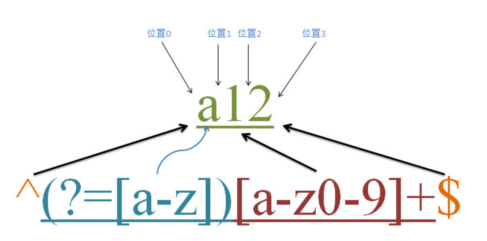
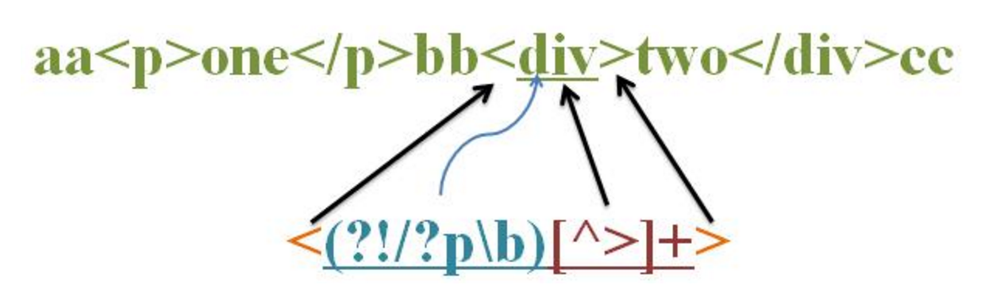
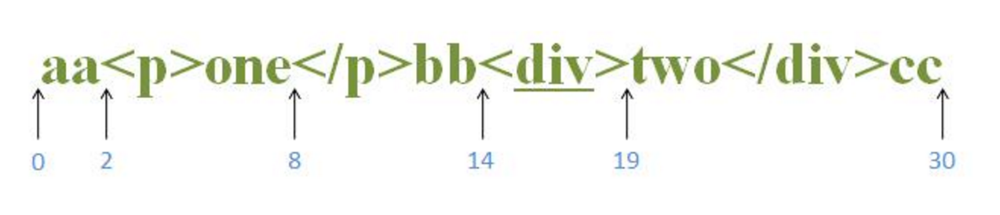

## 理解正则表达式—-环视

```
环视只进行子表达式匹配，不占有字符，匹配到的内容不保存到最终的匹配的结果，是零宽度的，它匹配的结果就是一个位置；
环视的作用相当于对所在的位置加了一个附加条件，只有满足了这个条件，环视子表达式才能匹配成功。

环视有顺序和逆序2种，顺序和逆序又分为肯定和否定，因此共加起来有四种；
但是javascript中只支持顺序环视，因此我们这边来介绍顺序环视的匹配过程；
```

如下说明：
```
1.  (?=Expression):  
顺序肯定环视，含义是所在的位置右侧位置能够匹配到regexp.

2. (?!Expression)
顺序否定环视，含义是所在的位置右侧位置不能匹配到regexp
```

### 顺序肯定环视

先看如下图：


```
首先我们需要明白的是：^和$ 是匹配的开始和结束位置的；
?= 是顺序肯定环视，它只匹配位置，不会占有字符，因此它是零宽度的。

这个正则的含义是：
以字母或者数字组成的，并且第一个字符必须为小写字母开头；
```

匹配过程如下：
```
首先由元字符^取得控制权，需要以字母开头，接着控制权就交给 顺序肯定环视 (?=[a-z]); 
它的含义是：要求它所在的位置的右侧是有a-z小写字母开头的才匹配成功，字符a12，
第一个字符是a，因此匹配成功；我们都知道环视都是匹配的是一个位置，不占有字符的，是零宽度的，
因此位置是0，把控制权交给[a-z0-9]+,它才是真正匹配字符的，因此正则[a-z0-9]+从位置0开始匹配字符串a12，
且必须以小写字母开头，第一个字母是a匹配成功，接着继续从1位置匹配，是数字1，也满足，
继续，数字2也满足，因此整个表达式匹配成功；最后一个$符合的含义是以字母或者数字结尾的；
```

### 顺序否定环视 

当顺序肯定环视匹配成功的话，顺序否定环视就匹配失败，当顺序肯定环视匹配失败的话，那么顺序否定环视就匹配成功；

我们先看如下图：


```
源字符串：aa<p>one</p>bb<div>two</div>cc 

正则：<(?!/?p\b)[^>]+>
```

正则的含义是：匹配除<p>之外的其余标签；

如下图：


匹配过程如下：
```
首先由”<” 取得控制权，从位置0开始匹配，第一个位置和第二个位置都是字符a，因此匹配失败.
 接着从位置2匹配，匹配到<， 匹配成功了，现在控制权就交给(?!/?p\b)；?!是顺序否定环视，
 只匹配一个位置，不匹配字符，这个先不用管，首先是 /? 取得控制权，
 
 它的含义是：可匹配/,或者不匹配/, 接着往下匹配的是p字符，匹配失败，进行回溯，
 不匹配，那么控制权就到一位了p字符，p匹配p，匹配成功，控制权就交给\b; 
 \b的含义是匹配单词的边界符，\b就匹配到了 > ，结果就是匹配成功，子表达式匹配就完成了；
 /?p\b 就匹配成功了；所以(?!/?p\b) 这个就匹配失败了；从而使表达式匹配失败；
 我们继续往下匹配，从b字符开始，和上面一样匹配失败，当位置是从14开始的时候 < 字符匹配到”<”，匹配成功，
 把控制权又交给了(?!/?p\b)， 还是/?取得控制权，和上面匹配的逻辑一样，最后?p\b匹配失败了，
 但是(?!/?p\b) 就匹配成功了，因此这一次表达式匹配成功；
 
如下代码匹配：
var str = “aa<p>one</p>bb<div>two</div>cc”;

// 匹配的结果为div，位置从14开始 19结束

console.log(str.match(/<(?!\/?p\b)[^>]+>/)[0]);
```