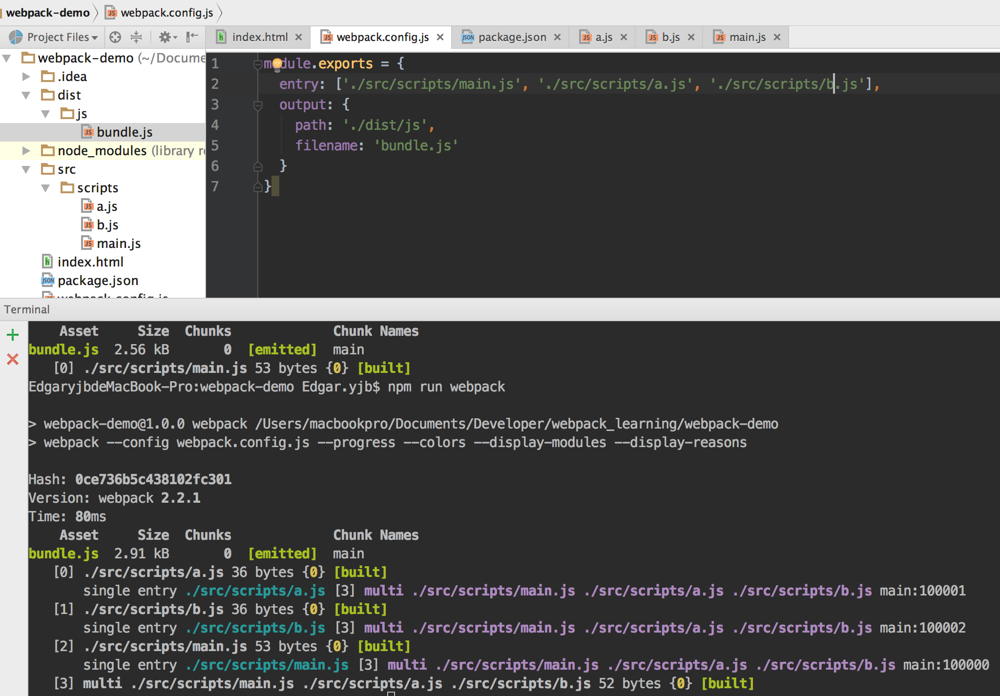
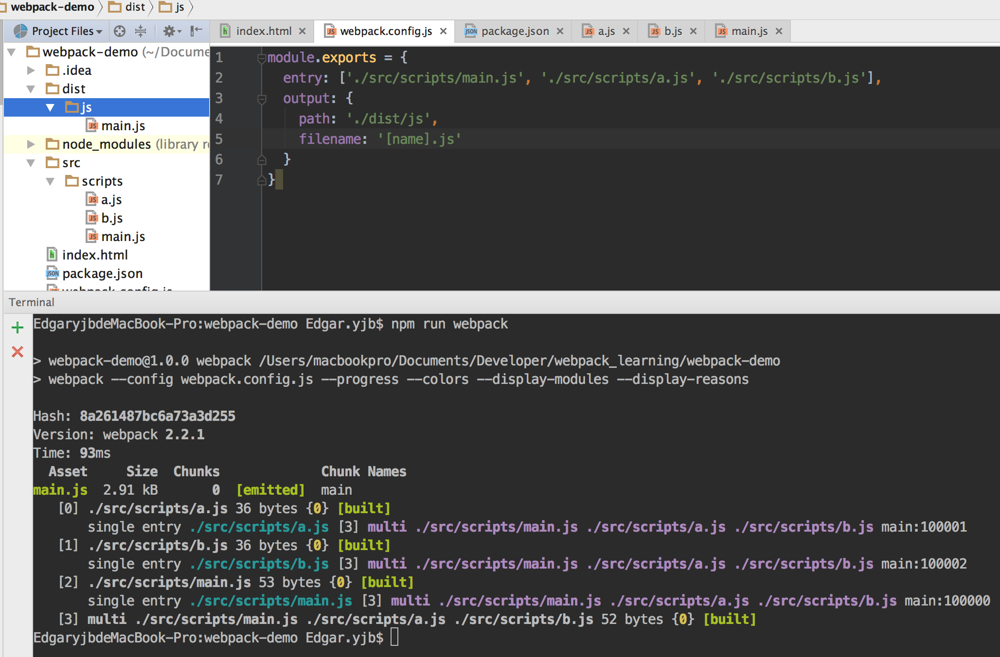
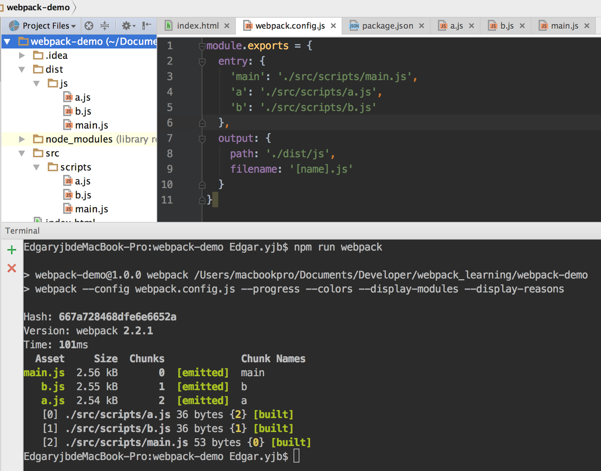
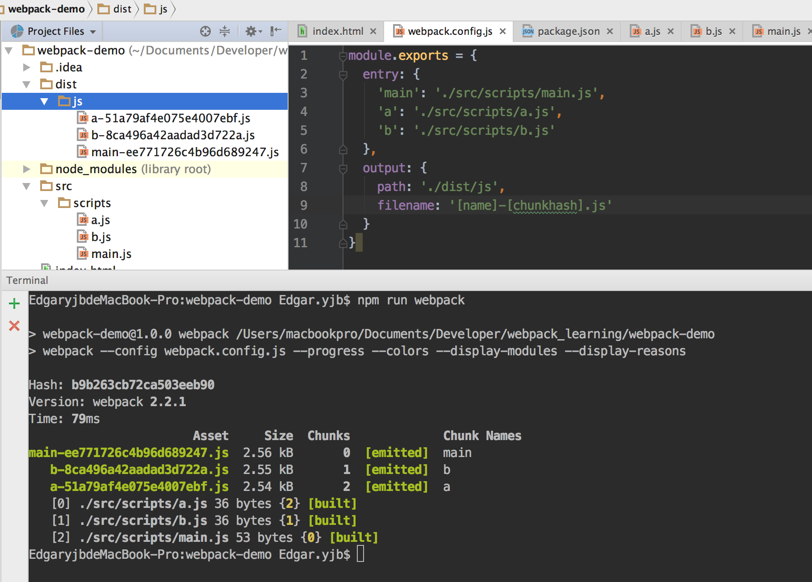

# webpack.config.js中entry和output项

webpack.config.js配置文件中,entry选项可以有多种指定方法:

    entry: "./app/entry", // string | object | array
    entry: ["./app/entry1", "./app/entry2"],
    entry: {
    a: "./app/entry-a",
    b: ["./app/entry-b1", "./app/entry-b2"]
    },
    
对应entry三种不同的写法,output配置中的filename也可以对应有不同的配置:

    filename: "bundle.js", // string
    filename: "[name].js", // for multiple entry points
    filename: "[chunkhash].js", // for long term caching
    // the filename template for entry chunks
    
## 第1种,entry为字符串或数组,output为指定文件名,这种情况下,多个文件会被打包到一个模块

## 第2种,entry为字符串或数组,output使用`[name]`占位符,这种情况下,多个文件会被打包到一个模块,
且打包的模块名为entry数组中的第一个文件名

## 第3种,entry指定为对象(即不同的chunk),output使用`[name]`占位符,这种情况下,webpack会按不同的chunk打包成不同的模块,
并且每个模块打包的名称即为对应的chuck名

## 第4种,entry指定为对象(即不同的chunk),output使用`[name]`和`[chunkhash]`占位符形成的模板字符串,这种情况下,
webpack会按不同的chunk打包成不同的模块,并且每个模块打包的名称为指定的模板形成的名称

# 注: 第4总情况下,chunkhash即为每个模块的hash值,这个值只有在文件的内容发生变化时才会改变,在项目中通常会使用到它!!!项目上线时,只上线内容发生变化的模块。